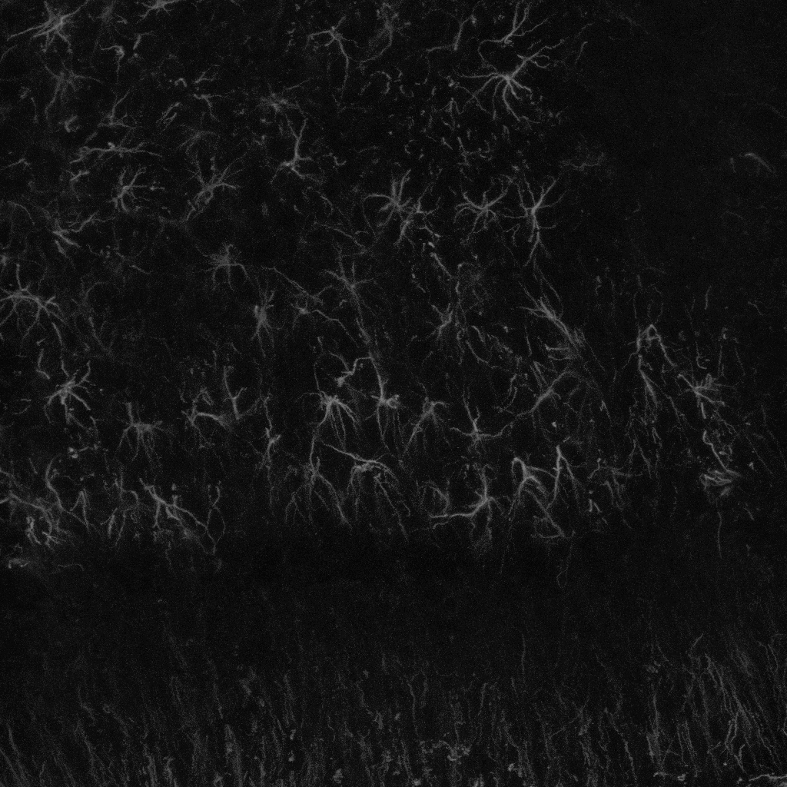
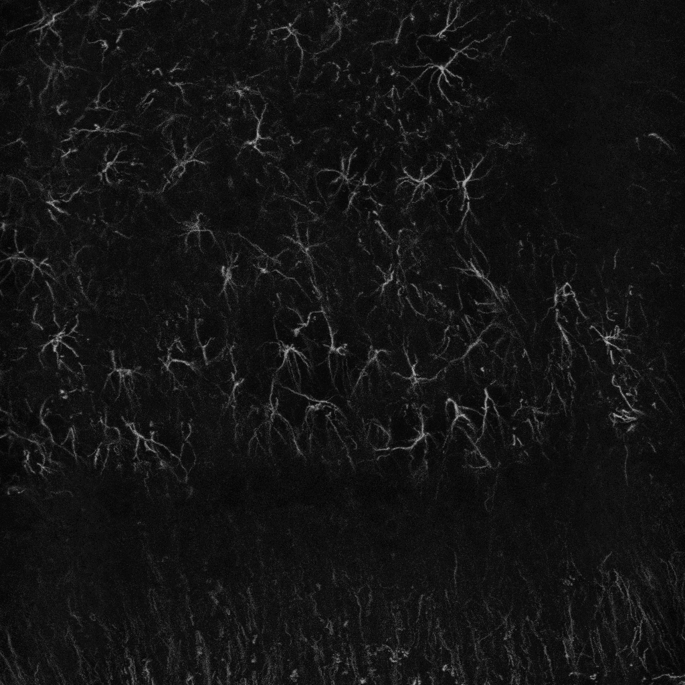
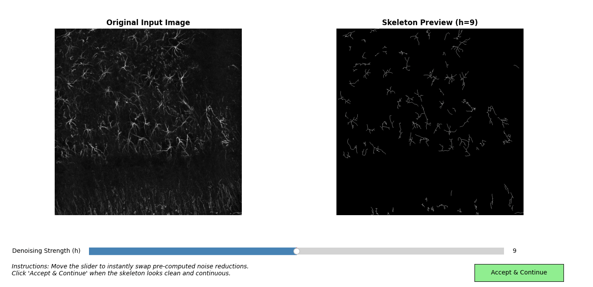
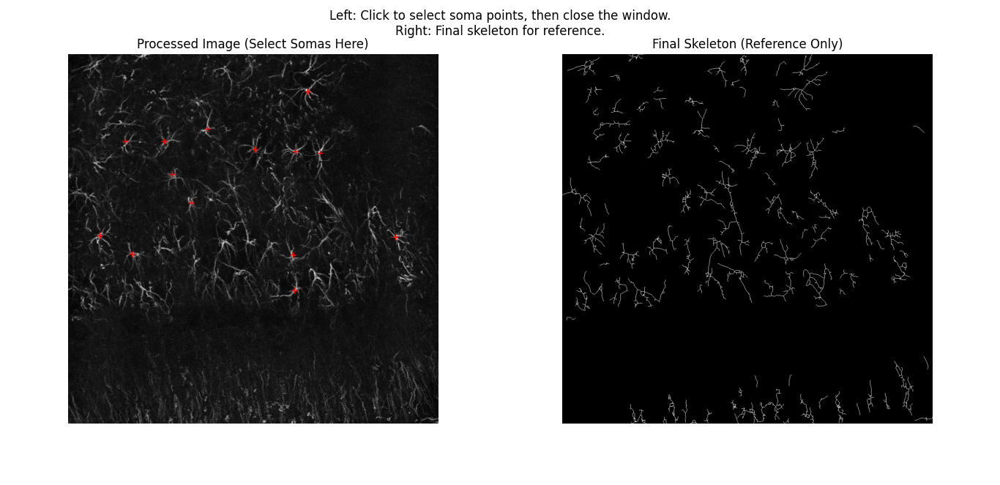
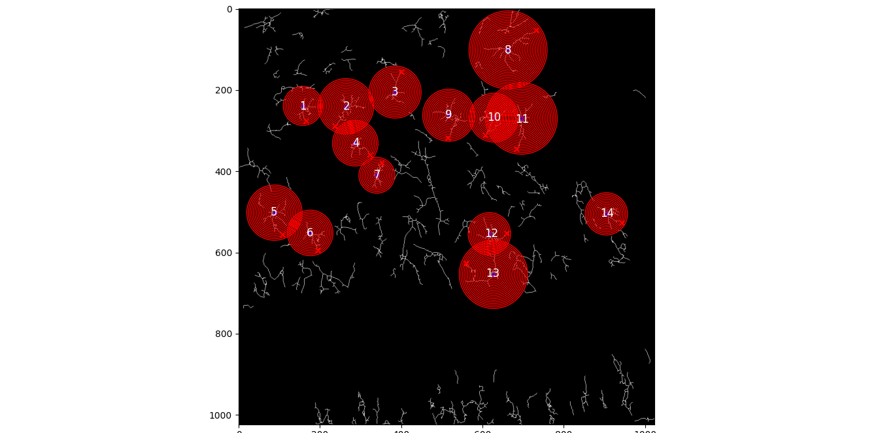
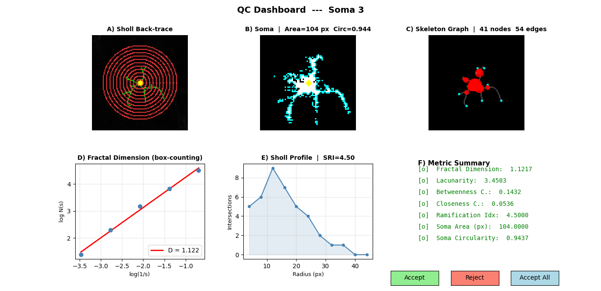

# 🧠 MicroSholl — Microglia Morphometrics and Batch Sholl Analysis

<a href="https://microglia-sholl-pipelinev2-jshmxvlbw7e88xqpbjvkxf.streamlit.app/">
  
</a>

> A Python research pipeline for exploratory 2-D Sholl analysis of microglial
> images, with interactive quality control and batch processing.

---

## Table of Contents

1. [Introduction](#introduction)
2. [Why MicroSholl](#why-microsholl)
3. [What's New in v2.0](#whats-new-in-v20)
4. [Pipeline Overview](#pipeline-overview)
5. [Feature Deep-Dives](#feature-deep-dives)
   - [Patch-wise Adaptive Preprocessing](#a-patch-wise-adaptive-preprocessing)
   - [Automated Denoising with Interactive Validation](#b-automated-denoising-with-interactive-validation)
   - [Soma Selection](#c-soma-selection)
   - [Sholl Analysis & Morphometrics](#d-sholl-analysis--morphometrics)
   - [Interactive QC Dashboard](#e-interactive-qc-dashboard)
   - [Batch Processing & Master CSV](#f-batch-processing--master-csv)
   - [Statistical Post-processing](#g-statistical-post-processing)
6. [Output Data Format](#output-data-format)
7. [Repository Structure](#repository-structure)
8. [Installation](#installation)
9. [Usage](#usage)
10. [Replicability & Scientific Rationale](#replicability--scientific-rationale)
11. [Technologies Used](#technologies-used)
12. [Author Contributions](#author-contributions)
13. [Citation](#citation)

---

## Introduction

Microglial morphology is a useful quantitative correlate of cellular state, but
it is not a direct measurement of inflammatory function. Ramification and soma
shape should be interpreted in the context of species, brain region, staining,
imaging, and complementary molecular or functional measurements. Sholl analysis
counts crossings between concentric circles and a reconstructed cell arbor and
is one established way to describe spatial complexity.

However, standard implementations (e.g., ImageJ/Fiji plugins) suffer from:
- **Manual, time-consuming workflows** that bottleneck large studies
- **Sensitivity to image quality**, causing fragmented skeletons and erroneous counts
- **No built-in quality control**, leading to undetected analysis errors
- **No traceability**, making it difficult to reproduce or audit results

**MicroSholl** is a semi-automated Python pipeline intended to make this workflow
inspectable and easier to repeat. Its outputs require visual QC and experimental
validation before use in inferential or publication workflows.

> [!IMPORTANT]
> **Validation status:** Selected computational behaviors have synthetic test
> coverage. Representative real-image validation against manual annotations or
> established reference workflows has not yet been completed. Treat exported
> measurements as preliminary until agreement and repeatability are established
> for the intended images and experimental setting.

---

## Why MicroSholl

| Feature | MicroSholl |
|---|:---:|
| Automated skeleton extraction | ✅ |
| Adaptive noise reduction | ✅ |
| User-reviewed denoising | ✅ |
| Multi-cell batch analysis | ✅ |
| Interactive QC per cell | ✅ |
| Fractal dimension and graph descriptors | ✅ |
| Master CSV across image files | ✅ |
| Per-cell images and parameter metadata | ✅ |

---

## What's New in v2.0

This release represents a major upgrade over the original pipeline, adding several key features:

### 🎛️ Automated Denoising UI
The original pipeline required manually selecting an `h` denoising value from a static grid. v2.0 replaces this with:
- **Wavelet noise estimation** using `skimage.restoration.estimate_sigma` to compute a heuristic starting `h` value
- **Pre-computed skeleton previews** for a range of ±4 values around that starting value
- The user reviews or adjusts the value with visual feedback before committing

### 📊 Interactive QC Dashboard
Each cell now receives a full 6-panel quality control dashboard before its data is committed to the CSV:
- Original image with Sholl circles overlay
- Binary segmentation
- Skeleton graph (colored by betweenness centrality)
- Fractal Dimension log-log regression
- Per-cell Sholl profile curve
- Metric summary card with configurable QC ranges (not biological norms)
- GUI buttons: **[Accept]**, **[Reject]**, **[Accept All]** — replaces error-prone terminal input

### 🔬 Extended Morphometric Feature Extraction
Beyond raw Sholl intersections, v2.0 now computes and exports:
- **Fractal Dimension** (box-counting method)
- **Lacunarity** (morphological complexity)
- **Betweenness & Closeness Centrality** (graph-theory metrics on skeleton graph)
- **Sampled ramification index** (maximum intersections divided by intersections at the first sampled radius)
- **Soma Area & Circularity** (shape descriptors)

### 📁 Batch Processing & Master CSV
The pipeline now accepts **multiple image files in a single session**:
- Select 1 to N images via a multi-file dialog (hold Ctrl/Shift)
- Each image is processed sequentially with its own denoising UI, soma selection, and QC review
- A global `MASTER_Sholl_Metrics_Batch.csv` is automatically generated at the end, with an `Image_Name` column as recorded analysis metadata

---

## Pipeline Overview

```
  ┌─────────────────────────────────────────────────────────────┐
  │  USER selects 1–N image files via multi-file dialog         │
  └───────────────────────┬─────────────────────────────────────┘
                          │  for each image:
                          ▼
  ┌─────────────────────────────────────────────────────────────┐
  │  1. Patch-wise Adaptive CLAHE                               │
  │     → Divides image into local patches                      │
  │     → Applies CLAHE independently per patch                 │
  │     → Applies local enhancement; requires dataset validation │
  └───────────────────────┬─────────────────────────────────────┘
                          ▼
  ┌─────────────────────────────────────────────────────────────┐
  │  2. Automated Denoising (NL-Means) + Interactive Slider UI  │
  │     → estimate_sigma() for a heuristic starting value       │
  │     → Pre-computed skeleton range shown to user in real-time│
  │     → User confirms or fine-tunes before proceeding         │
  └───────────────────────┬─────────────────────────────────────┘
                          ▼
  ┌─────────────────────────────────────────────────────────────┐
  │  3. Morphological Binarization & Skeletonization            │
  │     → Top-hat transform → Otsu binarization                 │
  │     → Fragment removal → Morphological closing/dilation     │
  │     → Zhang-Suen skeletonization                            │
  │     → Gap bridging → Isolated fiber removal (2-pass)        │
  └───────────────────────┬─────────────────────────────────────┘
                          ▼
  ┌─────────────────────────────────────────────────────────────┐
  │  4. Interactive Soma Selection                              │
  │     → User clicks soma positions on the processed image     │
  │     → Skeleton displayed as reference on the right          │
  │     → Coordinates snapped to nearest skeleton point         │
  └───────────────────────┬─────────────────────────────────────┘
                          ▼
  ┌─────────────────────────────────────────────────────────────┐
  │  5. Per-Cell Connected Component Isolation                  │
  │     → 8-connectivity labeling isolates each cell's arbor    │
  │     → Reduces mixing of disconnected arbors                 │
  └───────────────────────┬─────────────────────────────────────┘
                          ▼
  ┌─────────────────────────────────────────────────────────────┐
  │  6. Sholl Analysis + Full Morphometrics Extraction          │
  │     → Concentric circles at step_size = 4 px               │
  │     → Intersection counting at each radius                  │
  │     → Fractal Dimension, Lacunarity, Graph centralities,    │
  │        Sampled ramification index, Soma shape               │
  └───────────────────────┬─────────────────────────────────────┘
                          ▼
  ┌─────────────────────────────────────────────────────────────┐
  │  7. Interactive QC Dashboard (per cell)                     │
  │     → 6-panel visual review                                 │
  │     → [Accept] / [Reject] / [Accept All] GUI buttons        │
  │     → Rejected cells flagged in output folder               │
  └───────────────────────┬─────────────────────────────────────┘
                          ▼
  ┌─────────────────────────────────────────────────────────────┐
  │  8. CSV Export                                              │
  │     → Per-image CSV (sholl_intersections_<name>.csv)        │
  │     → Global MASTER_Sholl_Metrics_Batch.csv                 │
  │        (with Image_Name column for cross-image traceability)│
  └─────────────────────────────────────────────────────────────┘
```

---

## Feature Deep-Dives

### (A) Patch-wise Adaptive Preprocessing

Global CLAHE can amplify both signal and background in heterogeneous tissue. The pipeline divides the input image into overlapping patches and applies CLAHE locally. Its effects on branch preservation, background suppression, and downstream skeletonization require dataset-specific validation.

<table align="center">
  <tr>
    <td align="center" width="50%">
      <br>
      <em><strong>Global CLAHE.</strong> Example output from whole-image enhancement.</em>
    </td>
    <td align="center" width="50%">
      <br>
      <em><strong>Patch-wise CLAHE.</strong> Example output from local enhancement; performance is dataset-dependent.</em>
    </td>
  </tr>
</table>

---

### (B) Automated Denoising with Interactive Validation


<p align="center">
  <br>
  <em><strong>Denoising UI.</strong> A heuristic starting <code>h</code> value is derived from wavelet noise estimation, and previews are pre-computed for a ±4 range. The user reviews or adjusts the value before analysis begins.</em>
</p>

**Methodological note:** Non-local Means denoising strength (`h`) affects whether
fine processes and noise are retained. The desktop interface uses wavelet noise
estimation as a starting point; this mapping is heuristic and must be visually
validated. The Streamlit interface starts from a configurable default.

---

### (C) Soma Selection

<p align="center">
  <br>
  <em><strong>Soma selection.</strong> The processed image (left) is displayed alongside the final skeleton (right) as a reference. Users click directly on soma cell bodies to define analysis anchors. Coordinates are snapped to the nearest skeleton point; users must verify that the resulting anchor is appropriate.</em>
</p>

---

### (D) Sholl Analysis & Morphometrics

<p align="center">
  <br>
  <em><strong>Sholl circle placement.</strong> Concentric circles are generated around each selected soma, extending to the farthest detected endpoint of the connected component.</em>
</p>

For each cell, the following metrics are extracted:

| Metric | Description | Reference |
|---|---|---|
| `Radius` | Distance from the soma center (px) | Sholl, 1953 |
| `Intersections` | Number of skeleton crossings at each radius | Sholl, 1953 |
| `Fractal_Dimension` | Box-counting fractal dimension of the arbor | Mandelbrot, 1982 |
| `Lacunarity` | Morphological heterogeneity of the arbor | Plotnick et al., 1996 |
| `Betweenness_Centrality` | Fraction of shortest paths through each node | Freeman, 1977 |
| `Closeness_Centrality` | Mean inverse distance to all other nodes | Bavelas, 1950 |
| `Ramification_Index` | Sampled ramification index: maximum intersections divided by intersections at the first sampled radius | Adapted from Schoenen, 1982 |
| `Soma_Area` | Area of the detected soma region (px²) | — |
| `Soma_Circularity` | Shape circularity index [0–1] | — |

The first-radius intersection count is a computational proxy for primary
branches, not a direct branch count. The sampled ramification index may depend
on soma segmentation, soma-anchor placement, and Sholl radius spacing and
therefore requires validation against a suitable reference workflow.

---

### (E) Interactive QC Dashboard

<p align="center">
  <br>
</p>

Each cell presents a 6-panel dashboard before its data is committed:

- **Panel A** — Original image with Sholl circles and soma marker
- **Panel B** — Binary segmentation mask
- **Panel C** — Skeleton graph colored by betweenness centrality
- **Panel D** — Fractal Dimension log-log regression (box-counting)
- **Panel E** — Per-cell Sholl intersection profile
- **Panel F** — Metric summary card with configurable QC ranges

The user responds via GUI buttons:
- **[Accept]** — include this cell in the output CSV
- **[Reject]** — exclude this cell; backtrace image is renamed `REJECTED_*` for audit
- **[Accept All]** — accept this and all remaining cells without further review

Rejected cells are **never silently dropped**: they are flagged and saved separately, enabling post-hoc audit.

---

### (F) Batch Processing & Master CSV


The pipeline accepts **one or more image files** simultaneously:

```
# One image
file_paths = ("path/to/M05_Iba1.tif",)

# Multiple images (hold Ctrl/Shift in the dialog)
file_paths = ("path/to/M05_Iba1.tif", "path/to/F02_Iba1.tif", ...)
```

Each image is processed sequentially. At the end of the session, a **global master CSV** is written:

```
MASTER_Sholl_Metrics_Batch.csv
  Image_Name | Soma_ID | Radius | Intersections | Fractal_Dimension | ...
  ────────────────────────────────────────────────────────────────────────
  M05_Iba1   |    1    |    4   |       8       |      1.42         | ...
  M05_Iba1   |    1    |    8   |       5       |      1.42         | ...
  F02_Iba1   |    1    |    4   |      11       |      1.38         | ...
  F02_Iba1   |    2    |    4   |       7       |      1.51         | ...
```

The `Image_Name` and `Soma_ID` columns provide recorded analysis metadata linking each row to a source filename and selected soma.

---

### (G) Statistical Post-processing

Population-level Sholl curves and statistics are computed in `plot_sholl_profiles.py`, which reads master CSVs and produces:
- Mean Sholl intersection curves with SEM across cells
- Outlier inspection and removal
- Condition-level comparisons

Zero-intersection observations are retained in summaries. For inferential work,
use `Animal_ID` as the biological replicate and preserve a stable cell identifier;
the optional mixed model includes animal and cell-level random effects.

<p align="center">
  <br>
  <em><strong>Population-level Sholl curves.</strong> Mean ± SEM intersection profiles across all accepted cells in the Sham condition.</em>
</p>

---

## Output Data Format

### Streamlit outputs

The browser workflow provides two downloadable tables:

- `master_sholl_intersections.csv` — one row per cell and sampled radius,
  including pixel and calibrated radii, intersections, group, image, cell ID,
  and selected processing parameters.
- `master_morphometrics.csv` — one summary row per accepted cell containing
  the computed morphology descriptors and selected processing parameters.

Streamlit does not produce the CLI JSON provenance manifest. Download both CSV
files before ending a hosted session because deployment storage is ephemeral.

### Desktop CLI outputs

Each CLI analysis run produces the following outputs in a dedicated folder
(`<image_name>_sholl_output/`):

```
F02_sholl_output/
  ├── F02_gray_scale_image.png         ← Original image copy
  ├── F02_processed_image.png          ← After patch-wise CLAHE
  ├── F02_den_th_image.png             ← After denoising + top-hat
  ├── F02_binary.png                   ← Binary mask
  ├── F02_skeleton.png                 ← Final skeleton
  ├── F02_soma_and_radii.png           ← Sholl circles overlay
  ├── F02_backtrace_soma_1.png         ← Per-cell QC backtrace
  ├── F02_REJECTED_backtrace_soma_2.png   ← Flagged rejected cell
  ├── F02_qc_dashboard_soma_1.png      ← Per-cell QC dashboard
  ├── F02_run_manifest.json             ← Input hash, environment, and parameters
  └── sholl_intersections_F02.csv      ← Per-image morphometric data

MASTER_Sholl_Metrics_Batch.csv         ← Aggregated data from all images
```

---

## Repository Structure

```text
microglia-sholl-pipeline_v2/
│
├── data/                       # Example input images and demo outputs
│
├── run_sholl_pipeline.py       # ★ Main pipeline:
│                               #   preprocessing → skeleton → soma selection
│                               #   → Sholl analysis → QC → CSV export
│                               #   Supports single and batch processing
│
├── morphology_features.py      # Morphometric feature extraction:
│                               #   fractal dimension, lacunarity,
│                               #   graph centralities, sampled ramification index,
│                               #   soma shape, QC dashboard generation
│
├── plot_sholl_profiles.py      # Statistical post-processing and visualization:
│                               #   population-level curves, SEM, outlier removal
│
├── merge_sholl_results.py      # Utility to merge per-image CSVs
│
├── tests/                      # Unit and regression tests
├── app.py                      # Streamlit interface
├── provenance.py               # Machine-readable run metadata
│
├── README.md                   # This file
├── LICENSE                     # MIT License
└── requirements.txt            # Python dependencies
```

---

## Installation

### Windows PowerShell

```powershell
git clone https://github.com/LorenzoZam/microglia-sholl-pipeline_v2.git
cd microglia-sholl-pipeline_v2
python -m venv venv
.\venv\Scripts\Activate.ps1
python -m pip install -r requirements.txt
```

### macOS and Linux

```bash
git clone https://github.com/LorenzoZam/microglia-sholl-pipeline_v2.git
cd microglia-sholl-pipeline_v2
python -m venv venv
source venv/bin/activate
python -m pip install -r requirements.txt
```

**Python 3.10–3.12, tested in CI; deployment runtime Python 3.12.**

---

## Usage

### Single or Batch Analysis

```bash
python run_sholl_pipeline.py
```

A file dialog will open. Select **one or more** image files (`.tif`, `.tiff`, `.png`, `.jpg`, `.bmp`).

### Spatial calibration

Spatial calibration is not automatically inferred from image metadata.
Streamlit users must verify and enter the image-specific pixel size in µm/px.
The desktop CLI exports Sholl radii in pixels. Statistical post-processing uses
row-level calibration when it is present and otherwise falls back to
**0.56 µm/px**; verify this value before interpreting distances in micrometres.

**Step by step:**
1. **Denoising UI** — review the pre-computed skeleton previews, adjust the slider if needed, confirm
2. **Soma selection** — click on each cell body in the processed image, then **close the window**
3. **QC Dashboard** — review each cell and click **[Accept]**, **[Reject]**, or **[Accept All]**
4. Repeat for each selected image
5. Find `MASTER_Sholl_Metrics_Batch.csv` in the same folder as your images

### Statistical visualization

```bash
python plot_sholl_profiles.py
```

Reads the master CSV and produces population-level curves.

### Streamlit app

[Launch the Streamlit app](https://microglia-sholl-pipelinev2-jshmxvlbw7e88xqpbjvkxf.streamlit.app/)

```bash
streamlit run app.py
```

The web interface accepts TIFF, PNG, and JPEG uploads. Uploaded files are placed
in a randomized per-session temporary directory and are deleted when that session
is restarted. Cloud storage is ephemeral; download both CSV outputs before ending
the session. The default upload limit is 200 MB per file. Do not upload sensitive
human data to a public deployment without an approved data-handling process.

---

## Replicability & Scientific Rationale

The repository includes the following reproducibility-oriented features:

| Principle | Implementation |
|---|---|
| **Recorded analysis metadata** | The CLI writes a JSON run manifest; Streamlit exports selected parameters with each row |
| **Reviewed denoising** | The user records and reviews the selected NLM settings |
| **Saved intermediate outputs and review records** | The CLI saves selected intermediate images; rejected cells are flagged separately |
| **Recorded row identifiers** | CLI rows include `Image_Name` and `Soma_ID` for connection to the source filename and selected soma |
| **Bounded dependencies** | Compatible version ranges are declared and CI tests supported Python versions |
| **Regression tests** | `tests/` covers Sholl crossings, image borders, small images, identity, and zero retention |

The manifest and exported parameters improve computational traceability. Exact
reproduction can still depend on the operating system and numerical-library
versions, so archived analyses should preserve the manifest, inputs, outputs,
and a locked environment.

### Scientific limitations

- The pipeline analyzes 2-D images; it does not reconstruct 3-D arbors.
- Segmentation and gap bridging are heuristic and require dataset-specific validation.
- Morphology is not synonymous with microglial inflammatory or functional state.
- The displayed QC ranges are software defaults, not validated biological norms.
- Cells are nested within images and animals. Treating cells as independent
  biological replicates is pseudoreplication; define the experimental unit first.
- Validate agreement and repeatability against manual annotations or an established
  reference workflow before using measurements as study endpoints.

---

## Technologies Used

| Library | Role |
|---|---|
| [Python 3.10–3.12](https://python.org) | Tested in CI; deployment runtime uses Python 3.12 |
| [NumPy](https://numpy.org) | Numerical computing |
| [Pandas](https://pandas.pydata.org) | Data handling and CSV export |
| [OpenCV](https://opencv.org) | Image I/O, CLAHE, morphological operations |
| [scikit-image](https://scikit-image.org) | Skeletonization, connected components, denoising estimation |
| [SciPy](https://scipy.org) | Spatial distance computations |
| [NetworkX](https://networkx.org) | Skeleton-to-graph conversion and centrality metrics |
| [Matplotlib](https://matplotlib.org) | Interactive UI, QC dashboards, Sholl plots |
| [tkinter](https://docs.python.org/3/library/tkinter.html) | File selection dialogs (stdlib) |

Compatible dependency ranges are listed in `requirements.txt`; exact versions are
recorded in each CLI run manifest. Development dependencies are listed separately
in `requirements-dev.txt`.

---

## Example image attribution

Example images are derived from the following publicly available dataset:

**Effects of PCB52 (2,2',5,5'-Tetrachlorobiphenyl) on the Rat Brain After Subacute Nose-Only Inhalation Exposure**  
BioImage Archive accession: **S-BIAD1280**  
DOI: **[10.6019/S-BIAD1280](https://doi.org/10.6019/S-BIAD1280)**

The images are used for methodological demonstration. README figures may show
derived preprocessing, segmentation, skeletonization, or display outputs and
should not be interpreted as unmodified biological measurements.

---

## Author Contributions

Lorenzo Zammariello designed and implemented the MicroSholl workflow, Streamlit
interface, analysis integration, statistical post-processing, testing,
documentation, and deployment. The project integrates established third-party
scientific Python libraries and published computational concepts; this statement
does not claim authorship of those external algorithms or independent external
validation of the resulting measurements.

---

## Citation

If you use this pipeline in your research, presentations, or publications, please cite the software as follows:

**APA:**
> Zammariello, L. (2026). MicroSholl: Microglia Morphometrics and Batch Sholl Analysis (v2.0.0). GitHub. https://github.com/LorenzoZam/microglia-sholl-pipeline_v2

**BibTeX:**
```bibtex
@software{Zammariello_MicroSholl_2026,
  author = {Zammariello, Lorenzo},
  title = {{MicroSholl: Microglia Morphometrics and Batch Sholl Analysis}},
  url = {https://github.com/LorenzoZam/microglia-sholl-pipeline_v2},
  version = {2.0.0},
  year = {2026}
}
```

> [!NOTE]
> You can also use the **"Cite this repository"** button on the GitHub sidebar to export the citation in your preferred format.

> This software is provided "as is", without warranty of any kind. Contributions and forks are welcome under the MIT License.
