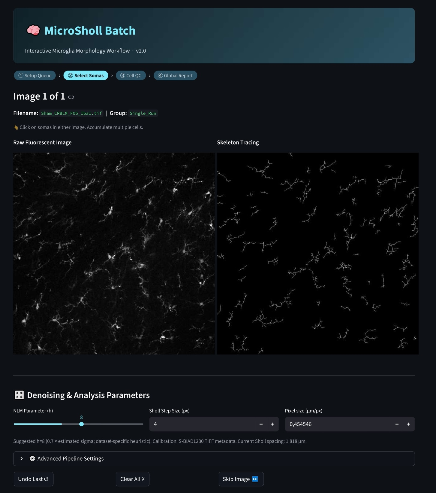
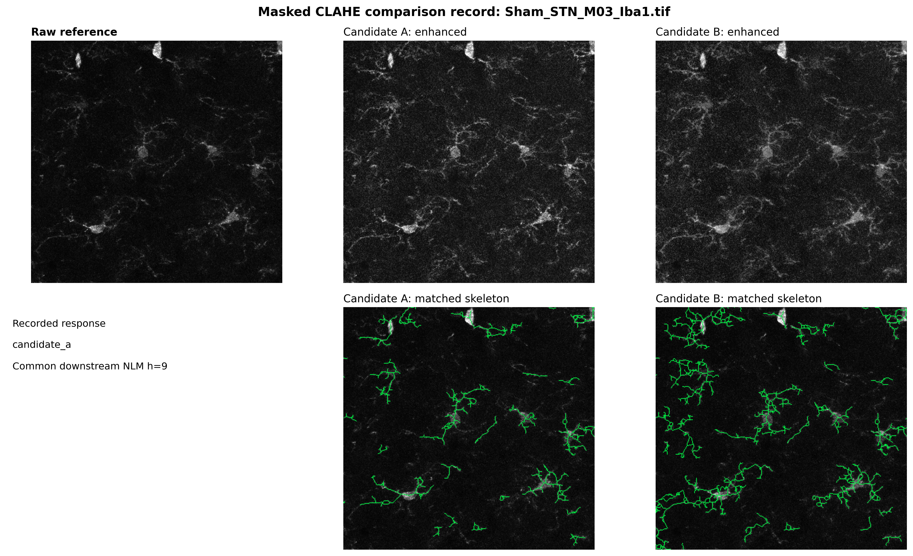
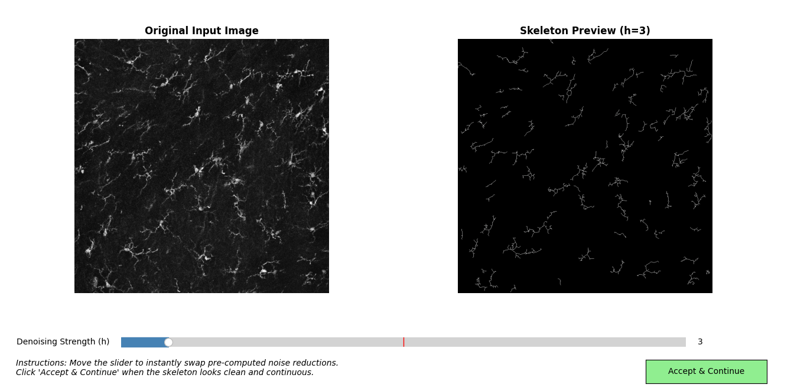
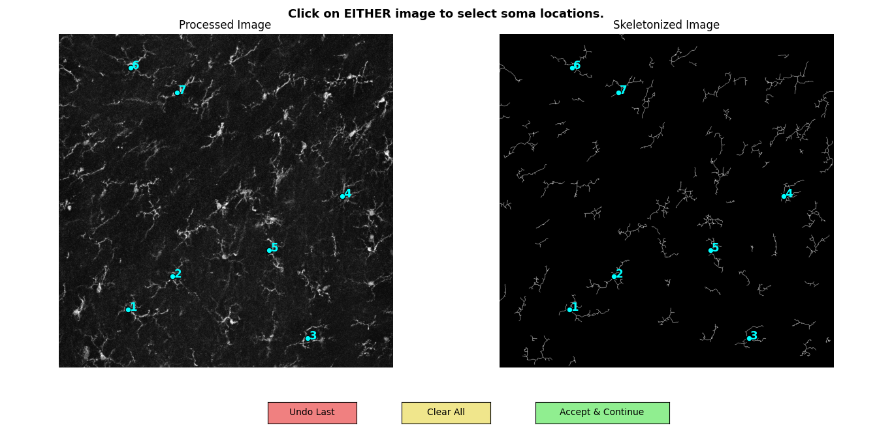
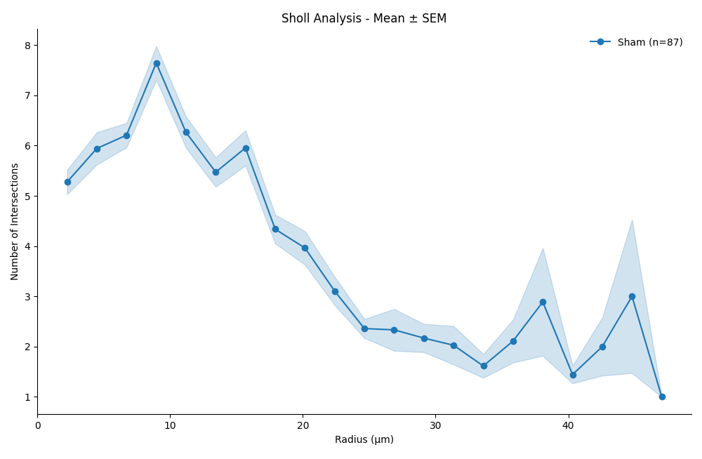

# MicroSholl

  

  
  
  

Human-in-the-loop analysis of 2-D microglial images, from image-aware
preprocessing to Sholl profiles, per-cell morphology estimates, quality
control, and structured export.

**Designed and implemented by Lorenzo Zammariello.**

**[Launch the public Streamlit app →](https://microglia-sholl-pipelinev2-jshmxvlbw7e88xqpbjvkxf.streamlit.app/)**

> [!IMPORTANT]
> **Validation status:** selected computational behaviors have synthetic test
> coverage, and the NLM starting heuristic has an exploratory dataset-specific
> calibration record. Representative real-image agreement against manual
> annotations or an established reference workflow has not yet been completed.
> Treat the measurements as preliminary until they are validated for the
> intended images and experimental setting.

## At a glance

| | |
|---|---|
| **Input** | 2-D, single-channel microscopy images with a verified marker and pixel size |
| **Processing** | Local contrast adaptation → reviewed denoising → segmentation → skeleton → per-cell analysis |
| **Output** | Sholl profiles, selected morphology estimates, parameters, and QC information |
| **Interfaces** | Public browser app and a local desktop batch workflow |
| **Current evidence** | Synthetic software tests and exploratory Iba1 parameter and preprocessing reviews; real-image agreement pending |

Microglial morphology can be a useful quantitative correlate of cellular state,
but it is not a direct measure of inflammation or function. MicroSholl is
therefore a measurement and review workflow, not a biological-state classifier.

   
  <em><strong>Browser workflow.</strong> A public Iba1 example is shown beside its reconstructed skeleton. The researcher can verify the denoising value, Sholl spacing, and image-specific spatial calibration before selecting cells.</em>

## What I designed and implemented

MicroSholl combines established methods—including CLAHE, Non-local Means
denoising, Otsu thresholding, skeletonization, and Sholl analysis—with
project-specific decision logic and interaction design. The original
contribution is their integration into an inspectable workflow that reduces
repetitive parameter tuning while keeping consequential decisions visible to
the researcher.

| Practical problem | Design response | Researcher benefit | Current limitation |
|---|---|---|---|
| One global contrast setting is a poor fit for heterogeneous fluorescence fields | Entropy- and variance-guided, patch-wise CLAHE with overlapping regions and Gaussian blending | Provides a consistent first-pass enhancement without cropping and tuning each region separately | Empirical rules require dataset-specific visual and quantitative validation |
| Choosing denoising strength by repeated trial and error is slow | Noise-estimated NLM starting value plus direct skeleton review | Starts each image from a reproducible, reviewable value while preserving user control | The multiplier is an exploratory Iba1 heuristic, not a universal optimum |
| Automated batches can hide segmentation errors | Soma selection, visual skeleton feedback, and per-cell inclusion decisions | Links human review to the analyzed cell before export | QC quality still depends on the reviewer and protocol |
| Multi-image experiments create manual bookkeeping | Group-aware Streamlit queues or desktop batch folders, consistent within-run row identifiers, and recorded parameters | Reduces manual collation and makes outputs easier to inspect | Experimental-unit metadata must still be verified by the researcher |

### 1. Adaptive local contrast—the “box” design

A single whole-image enhancement strength can under-process dim regions while
amplifying background elsewhere. MicroSholl instead:

1. samples overlapping local regions;
2. selects a nominal 84 or 168 px region size from local entropy;
3. selects CLAHE strength from local entropy and variance relative to the whole image;
4. processes the regions in parallel; and
5. recombines them with Gaussian weights to avoid hard transitions.

This stage is **adaptive contrast enhancement**, not denoising. It was designed
to provide a useful first pass across spatially heterogeneous images and to
reduce repeated region-by-region contrast adjustment. Whether it retains true
fine processes or amplifies background is dataset-dependent and must be checked.

#### Exploratory CLAHE comparison

A method-label-hidden comparison used the four public Iba1 example images and
matched the display range, downstream processing, and NLM strength within each
pair. Candidate A/B positions were counterbalanced, and each ROI was fixed on
the raw image before either result was shown. In an initial general-ROI pass,
single-setting whole-image CLAHE was preferred in all three non-excluded
comparisons; one image was excluded before candidate exposure. In a second,
post hoc pass targeting reviewer-selected regions with visibly heterogeneous background,
adaptive patch-wise CLAHE was preferred in three of four comparisons and the
whole-image method in one.

The two passes reused the same four images and one reviewer. The
targeted pass was performed after the initial results were known, reasons for
preference were not recorded, background heterogeneity was not defined by a
prespecified quantitative threshold, and no manual reference segmentation was
available. The result therefore suggests that visual preference may depend on
image region and background conditions; it does not establish that either
method preserves true processes more accurately. The design and interpretation
limits are documented in the
[CLAHE comparison protocol](validation/clahe/README.md).

   
  <em><strong>Targeted high-background example.</strong> Candidate A was adaptive patch-wise CLAHE and candidate B was single-setting whole-image CLAHE; both used the same downstream NLM <code>h=9</code>. The reviewer preferred A in this example. This is one post hoc qualitative comparison, not reference-based evidence of branch-preservation accuracy.</em>

### 2. Noise-aware, reviewer-guided denoising

Non-local Means strength (<code>h</code>) changes the downstream segmentation:
too much smoothing can remove weak processes, while too little can preserve
noise as false structure. MicroSholl estimates image noise and proposes:

<strong>starting h = clamp(int(0.7 × estimated sigma), 2, 20)</strong>

The factor <code>0.7</code> came from an exploratory second review of six
accepted, image-specific Iba1 benchmark regions and should be treated as a
dataset-specific starting value. The desktop workflow pre-computes the
resulting skeletons over a ±6 review interval so candidates can be compared
immediately after the initial computation. Streamlit uses the same starting
function with an interactive slider and cached processing.

The researcher sees the skeleton before committing to a value in either
interface. The calibration record and its limitations are documented in
<a href="validation/nlm_h/README.md">validation/nlm_h/README.md</a>.

   
  <em><strong>Reviewer-guided denoising.</strong> Nearby NLM candidates are pre-computed, so moving the slider immediately updates the skeleton preview. The suggested value is a dataset-specific heuristic starting point; the researcher reviews the reconstruction before continuing.</em>

### 3. Human-in-the-loop cell review

The workflow does not pretend that every automatically reconstructed object is
valid. Users select soma anchors, inspect the associated skeleton component,
and decide which cells to include.

- **Desktop:** dual-view soma selection, instant denoising comparison, a
  six-panel per-cell dashboard, and Accept / Reject / Accept All controls.
  Rejected backtraces are explicitly renamed.
- **Streamlit:** side-by-side raw-image and skeleton selection, numbered soma
  markers, Undo / Clear / Back controls, per-cell dashboards, and Include
  checkboxes before the downloadable tables are assembled.

   
  <em><strong>Soma selection.</strong> Corresponding markers on the processed image and skeleton make each proposed cell anchor inspectable before analysis.</em>

   
  <em><strong>Per-cell desktop QC.</strong> The dashboard connects the selected cell to its Sholl back-trace, local soma estimate, skeleton graph, descriptive metrics, and accept/reject decision. These displays support review but are not validated biological acceptance criteria.</em>

## Analysis workflow

  <strong>Image selection → local contrast adaptation → denoising review → skeletonization 
  → soma selection → Sholl and morphology measurements → per-cell QC → export</strong>

1. **Load images.** Use the bundled, calibrated Iba1 examples or supply
   single-channel images.
2. **Enhance local contrast.** Adaptive patch-wise CLAHE responds to spatial
   differences within the field.
3. **Review denoising.** Inspect how NLM strength changes the resulting skeleton.
4. **Build the skeleton.** Top-hat filtering, Otsu thresholding, configurable
   morphology, skeletonization, and gap-bridging create a computational arbor.
5. **Select somata.** Each click is associated with the nearest skeleton and its
   8-connected component.
6. **Measure each selected component.** Concentric radii are sampled at a
   configurable pixel interval, and intersections are counted as skeleton-edge
   crossings.
7. **Review and export.** Inspect cells before producing per-radius and per-cell
   results.

If segmentation or gap bridging connects two biological cells, connected-
component isolation cannot separate them automatically. This is one reason
visual QC remains part of the workflow.

## Try MicroSholl

### Option A — browser app

Use the **[public Streamlit app](https://microglia-sholl-pipelinev2-jshmxvlbw7e88xqpbjvkxf.streamlit.app/)**
without installing Python.

The browser workflow supports:

- a quick single-image mode and a group-aware batch experiment builder;
- bundled examples or TIFF, PNG, and JPEG uploads;
- editable pixel size, Sholl step, NLM strength, and advanced parameters;
- soma selection on the image or skeleton;
- descriptive group plots and two downloadable CSV files.

Hosted storage is ephemeral: download both CSV files before ending the session.
Do not upload sensitive human data to a public deployment without an approved
data-handling process.

### Option B — local desktop workflow

The local workflow supports a native multi-file dialog, pre-computed denoising
previews, desktop QC controls, saved intermediate images, and a JSON run
manifest.

#### Windows PowerShell

~~~powershell
git clone https://github.com/LorenzoZam/microglia-sholl-pipeline_v2.git
cd microglia-sholl-pipeline_v2
python -m venv venv
.\venv\Scripts\Activate.ps1
python -m pip install -r requirements.txt
python run_sholl_pipeline.py
~~~

#### macOS and Linux

~~~bash
git clone https://github.com/LorenzoZam/microglia-sholl-pipeline_v2.git
cd microglia-sholl-pipeline_v2
python3 -m venv venv
source venv/bin/activate
python -m pip install -r requirements.txt
python run_sholl_pipeline.py
~~~

The desktop file dialog accepts <code>.tif</code>, <code>.tiff</code>,
<code>.png</code>, <code>.jpg</code>, and <code>.bmp</code>. Some Linux
distributions require the system <code>python3-tk</code> package for the dialog.

**Supported Python:** Python 3.10–3.12, tested in CI. The deployment runtime is
Python 3.12.

To run the browser interface locally:

~~~bash
streamlit run app.py
~~~

To install development tools and run the tests:

~~~bash
python -m pip install -r requirements-dev.txt
python -m pytest
~~~

## Input and spatial calibration

For a scientifically interpretable run:

- supply a 2-D, single-channel image of the marker being analyzed;
- verify channel identity before extraction or grayscale conversion;
- prefer the original bit depth and document any conversion;
- keep acquisition and preprocessing consistent within a comparison; and
- verify the image-specific pixel size in µm/px.

Spatial calibration is **not inferred automatically from uploaded TIFF
metadata**. The four bundled Iba1 examples are pre-filled with their recorded
calibration of **0.454546 µm/px**. Uploaded images start with the current
**0.56 µm/px fallback**, which must be replaced when it does not match the
source image.

The default Sholl step is **4 px**. For the bundled examples this is
approximately **1.818 µm**; it is not automatically converted into a fixed
physical interval across datasets.

- **Streamlit** exports radii in pixels and micrometres using the value shown
  for that image.
- **Desktop CLI** exports radii in pixels.
- **Sholl-curve and mixed-model helpers** use row-level calibrated radii when
  available and otherwise fall back to 0.56 µm/px. Calibration must be checked
  before interpreting any physical distance.

## Outputs

### Streamlit outputs

The browser app provides:

- <code>master_sholl_intersections.csv</code> — one row per accepted cell and
  sampled radius, with pixel and calibrated radii, intersections, group, image,
  cell ID, and selected processing parameters;
- <code>master_morphometrics.csv</code> — one summary row per accepted cell
  with selected morphology estimates and processing parameters; and
- descriptive Sholl and morphology plots shown in the session.

Streamlit does **not** create the desktop JSON manifest or downloadable
intermediate/QC images.

### Desktop CLI outputs

For each input image, the desktop workflow writes a dedicated output directory
containing:

- grayscale, contrast-enhanced, top-hat, binary, skeleton, and Sholl-overlay images;
- reviewed-cell backtraces and available QC dashboards;
- a per-image Sholl/morphology CSV; and
- a JSON manifest with the input hash, Git state, environment versions, and
  processing parameters.

It also writes <code>MASTER_Sholl_Metrics_Batch.csv</code> across the selected
images. Rejected cells are excluded from CSV output and their backtrace is
renamed with a <code>REJECTED_</code> prefix. The manifest should not be
interpreted as a complete ledger of every QC decision.

## Measurements

All quantities below are computational descriptors of the reconstructed
skeleton or local binary soma region. They are not direct biological labels.

| Output | Computational definition or interpretation |
|---|---|
| **Sholl intersections** | Number of skeleton edges crossing each sampled circle around the selected anchor |
| **Maximum sampled radius** | Outermost sampled radius represented for the component |
| **Box-counting fractal-dimension estimate** | Scale-dependent estimate from occupied boxes |
| **Lacunarity** | Multi-scale gliding-box estimate of spatial heterogeneity |
| **Mean betweenness / closeness** | Mean node centrality values on the skeleton graph; interface exports differ |
| **Sampled ramification index** | Maximum Sholl count divided by the count at the first sampled radius |
| **Soma area / circularity** | Descriptors estimated from a locally processed binary soma region |

The first-radius count is a computational proxy for primary branches, not a
manual branch count. The sampled ramification index may change with soma
segmentation, anchor placement, and radius spacing.

## What is tested—and what is not

| Area | Evidence in this repository | Status |
|---|---|---|
| Sholl intersections | Synthetic single branches, rotation, unequal arms, a double-crossing U shape, tangency, and borders | Computationally tested |
| Morphology functions | Synthetic line behavior, exact path-graph centralities, finite-value and boundary checks | Computationally tested |
| Data/statistical handling | Stable cell IDs, retained recorded zeros, analytic mean/SEM cases, hierarchy and input validation | Computationally tested |
| NLM starting heuristic | Manual review record for six accepted Iba1 regions plus configuration tests | Dataset-specific exploratory calibration |
| Adaptive patch-wise enhancement | Software edge cases and two method-label-hidden qualitative passes on four public Iba1 images: whole-image preferred in 3/3 initial non-excluded comparisons; adaptive preferred in 3/4 targeted high-background comparisons | Exploratory visual review; reference-based accuracy pending |
| End-to-end cell measurements | Comparison with blinded manual annotations or a reference workflow | Not yet completed |
| Biological-state inference | Outside the software’s measurement scope | Not claimed |

Automated tests verify selected software behavior; they do not establish
segmentation accuracy, biological validity, branch preservation, or agreement
on representative real images.

## Statistical post-processing

Run:

~~~bash
python plot_sholl_profiles.py
~~~

The script provides exploratory mean ± SEM profiles and retains
zero-intersection rows that are present in the input. A missing cell–radius row
is not automatically the same as a recorded zero.

For data with verified <code>Group</code>, <code>Animal_ID</code>, and
<code>Cell_ID</code> fields, the optional Gaussian mixed-effects model uses:

  <strong>Intersections ~ natural-cubic-spline(Radius_um) × Group</strong>

- an animal random intercept;
- a cell-within-animal variance component;
- a Gaussian residual; and
- REML fitting.

The code validates key hierarchy and value constraints before fitting.
Nevertheless, the animal—not the cell—is normally the biological replicate.
The Gaussian response model, spline complexity, sample size, experimental-unit
definition, and missing-data process remain study-specific assumptions.
Descriptive cell-level plots do not by themselves prevent pseudoreplication.

   
  <em><strong>Illustrative descriptive profile.</strong> Here <code>n=87</code> denotes accepted cells, not animals or independent biological replicates. Mean and SEM are computed from the cell rows available at each sampled radius; the figure is not an animal-level inferential result.</em>

## Reproducibility features

- GitHub Actions runs the test suite on Python 3.10, 3.11, and 3.12.
- Runtime and development dependencies are declared separately.
- Shared defaults for denoising, calibration, and Sholl spacing live in
  <code>pipeline_config.py</code>.
- Desktop manifests record the input SHA-256, repository state, environment,
  dependency versions, and processing parameters.
- Bundled example origins, calibration, and hashes are documented in
  <a href="sample_images/README.md">sample_images/README.md</a>.
- Exploratory calibration records are kept outside production entry points.

Dependency ranges support compatibility testing but are not a fully locked
environment. Archive the input data, outputs, manifest, selected parameters,
and an environment lock file for a study that requires exact reconstruction.

## Repository map

~~~text
app.py                    Streamlit interface
run_sholl_pipeline.py     Desktop batch workflow and image-analysis core
morphology_features.py    Per-cell morphology estimates and QC figures
plot_sholl_profiles.py    Exploratory plots and mixed-effects analysis
pipeline_config.py        Shared calibrated defaults
provenance.py             Desktop run-manifest helpers
docs/images/              README interface and QC figures
sample_images/            Traceable bundled Iba1 demonstration inputs
validation/nlm_h/         Exploratory NLM calibration record
tests/                    Synthetic and software tests
tools/                    Dataset preparation and validation utilities
~~~

Research utilities are documented in <a href="tools/README.md">tools/README.md</a>.

## Scientific scope and limitations

- MicroSholl analyzes 2-D images and does not reconstruct 3-D arbors.
- Segmentation, adaptive enhancement, gap bridging, endpoint detection, and
  soma-region estimation are computational heuristics.
- A connected segmentation can merge neighboring cells into one component.
- QC thresholds are software flags, not validated biological norms.
- Recorded zero intersections are retained, but absent radius rows are not
  automatically imputed as zero.
- Some legacy summary helpers use a configured global pixel conversion; verify
  calibration throughout any statistical workflow.
- Morphology should be interpreted alongside species, brain region, marker,
  acquisition conditions, and complementary measurements.
- Representative images, blinded manual measurements, acceptance criteria, and
  inter-rater agreement are still needed for an end-to-end validation study.

## Example data

The four bundled files are calibrated, single-channel, 8-bit Iba1 examples
derived from the public BioImage Archive study:

**Effects of PCB52 (2,2',5,5'-Tetrachlorobiphenyl) on the Rat Brain After
Subacute Nose-Only Inhalation Exposure**

- BioImage Archive: [S-BIAD1280](https://www.ebi.ac.uk/biostudies/bioimages/studies/S-BIAD1280)
- DOI: [10.6019/S-BIAD1280](https://doi.org/10.6019/S-BIAD1280)
- Preparation details and file hashes:
  [sample_images/README.md](sample_images/README.md)

These images are demonstration inputs, not an independent validation benchmark.

## Core method references

- Sholl, D. A. (1953). Dendritic organization in the neurons of the visual and
  motor cortices of the cat.
  [PubMed 13117757](https://pubmed.ncbi.nlm.nih.gov/13117757/)
- Buades, A., Coll, B., & Morel, J.-M. (2005). A non-local algorithm for image
  denoising. [doi:10.1109/CVPR.2005.38](https://doi.org/10.1109/CVPR.2005.38)
- Otsu, N. (1979). A threshold selection method from gray-level histograms.
  [doi:10.1109/TSMC.1979.4310076](https://doi.org/10.1109/TSMC.1979.4310076)

## Citation

Citation metadata are provided in <a href="CITATION.cff">CITATION.cff</a> and
through GitHub’s **Cite this repository** menu.

~~~bibtex
@software{Zammariello_MicroSholl_2026,
  author  = {Zammariello, Lorenzo},
  title   = {MicroSholl: Microglia Morphometrics and Batch Sholl Analysis},
  url     = {https://github.com/LorenzoZam/microglia-sholl-pipeline_v2},
  version = {2.0.0},
  year    = {2026}
}
~~~

MicroSholl is distributed under the [MIT License](LICENSE).
